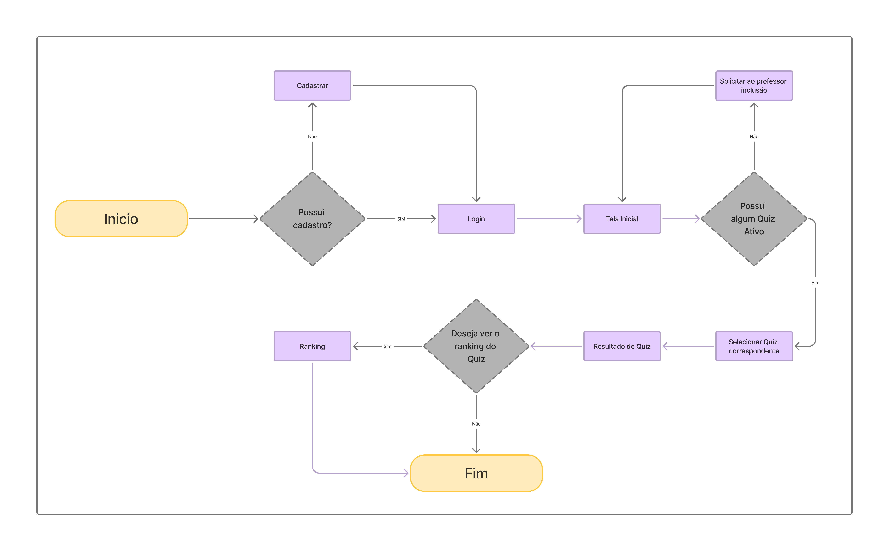

# Projeto de interface

Pré-requisitos: <a href="02-Especificacao.md"> Especificação do projeto</a>

Visão geral de como será a navegação do usuário por meio do sistema;

## Userflow:
 

### Diagrama de fluxo

## Wireframes

Protótipos usados no design de interface para sugerir a estrutura do nosso site web e o seu relacionamento entre suas páginas. Um wireframe web é uma ilustração que mostra o layout dos elementos fundamentais na interface.

## Interface do sistema

Visão geral da interação do usuário por meio das telas do sistema.  
Figma: https://www.figma.com/design/bT9XwGkdEZDRZD5wx5ov1G/Untitled?node-id=14-2&p=f&t=bcnLox1IbdCzbXxl-0 

1- Login

2- Cadastro de professor

3- Cadastro de aluno

4- Home

5- Quizz

6- Resultado de um quizz

7- Ranking

> Apresente as principais interfaces da plataforma em sua versão final.
